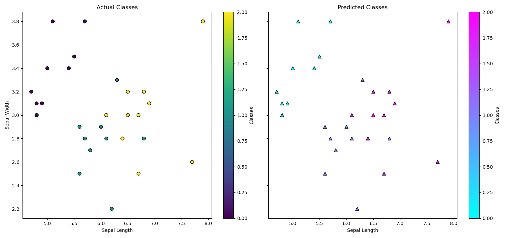

# KNN

#### 1.Fit(X,y) simply project all the points in the space, we use these points to find nearest points in predict method
#### 2.Predict(x) = count of class with maximum frequency in K-nearest neighbourhod of x

## Figure shows comparison of actual class and predicted class

## First comment
