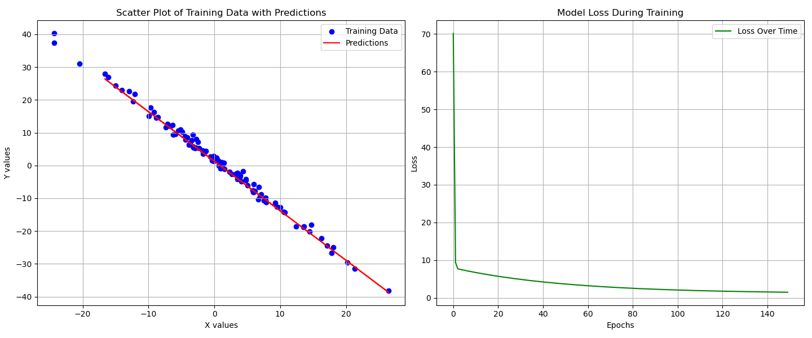

## plot for input data & predicted curve & loss function 

1. From the graph we can see that predicted line is fitting well for the data and loss converging to minimum.
2. We can add validation loss curve to see if model is overfitting for the train data
